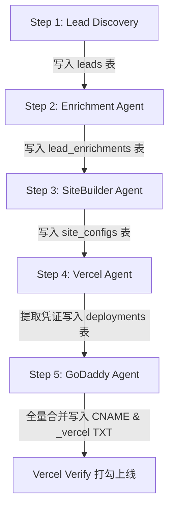

# Swiss LeadGen 多租户全自动化闭环部署与领域驱动架构标准

## 🌟 架构概览 (System Architecture)

本项目实现了 **100% 自动化、无人工干预的多租户动态网站部署流水线**。系统基于**领域驱动设计 (DDD)** 思想，将数据模型解耦为 4 大专业数据表，并通过 5 阶段 Agent 流水线与 GoDaddy API、Vercel API 深度集成。

---

## 🗄️ 1. 数据库解耦与中间态持久化 (Database Architecture)

所有 Agent 执行的中间态数据（从 Lead 搜集、动态 UI 配置到 DNS 凭证）**必须 100% 显式落存到 Neon PostgreSQL 数据库**，下一个 Agent 仅从数据库提取中间态，确保流水线的全容错与可复原性。

### 1.1 四大领域表结构

```sql
-- 1. 核心商家身份表 (leads)
CREATE TABLE IF NOT EXISTS leads (
    id VARCHAR(64) PRIMARY KEY,
    place_id VARCHAR(255) UNIQUE,
    name TEXT NOT NULL,
    category VARCHAR(100),
    address TEXT,
    city VARCHAR(100),
    canton VARCHAR(10),
    language VARCHAR(10),
    email VARCHAR(255),
    phone VARCHAR(100),
    website_hint TEXT,
    rating NUMERIC(3, 2),
    reviewCount INTEGER,
    google_maps_url TEXT,
    slug VARCHAR(255) UNIQUE,
    subdomain VARCHAR(255) UNIQUE,
    admin_pass VARCHAR(100),
    status VARCHAR(50) DEFAULT 'discovered',
    created_at TIMESTAMP DEFAULT CURRENT_TIMESTAMP,
    updated_at TIMESTAMP DEFAULT CURRENT_TIMESTAMP
);

-- 2. 深度信息与真实评价表 (lead_enrichments)
CREATE TABLE IF NOT EXISTS lead_enrichments (
    lead_id VARCHAR(64) PRIMARY KEY REFERENCES leads(id) ON DELETE CASCADE,
    opening_hours JSONB,
    photos_json JSONB,
    reviews_json JSONB,
    contact_person VARCHAR(100),
    social_links JSONB,
    updated_at TIMESTAMP DEFAULT CURRENT_TIMESTAMP
);

-- 3. Awwwards 动态 UI 配置表 (site_configs)
CREATE TABLE IF NOT EXISTS site_configs (
    lead_id VARCHAR(64) PRIMARY KEY REFERENCES leads(id) ON DELETE CASCADE,
    theme_color VARCHAR(50),
    hero_headline TEXT,
    hero_subtitle TEXT,
    services_json JSONB,
    badge_text VARCHAR(100),
    custom_css TEXT,
    config_json JSONB,
    updated_at TIMESTAMP DEFAULT CURRENT_TIMESTAMP
);

-- 4. 商业网络与 DNS 部署凭证表 (deployments)
CREATE TABLE IF NOT EXISTS deployments (
    lead_id VARCHAR(64) PRIMARY KEY REFERENCES leads(id) ON DELETE CASCADE,
    subdomain VARCHAR(255) NOT NULL,
    cname_target VARCHAR(255) DEFAULT '4486e1c3ac91a3bb.vercel-dns-017.com',
    dns_verification JSONB,  -- 保存 Vercel 返回的 vc-domain-verify=... 原始凭证数组
    vercel_status VARCHAR(50) DEFAULT 'pending',
    godaddy_status VARCHAR(50) DEFAULT 'pending',
    ssl_active BOOLEAN DEFAULT false,
    deployed_at TIMESTAMP DEFAULT CURRENT_TIMESTAMP,
    updated_at TIMESTAMP DEFAULT CURRENT_TIMESTAMP
);

-- 5. 全量整合视图 (v_leads_full) — 供前端与流水线统一查询
CREATE OR REPLACE VIEW v_leads_full AS
SELECT 
    l.*,
    le.opening_hours, le.photos_json, le.reviews_json, le.contact_person, le.social_links,
    sc.theme_color, sc.hero_headline, sc.hero_subtitle, sc.services_json, sc.badge_text, sc.config_json as site_config,
    d.cname_target, d.dns_verification, d.vercel_status, d.godaddy_status, d.ssl_active, d.deployed_at
FROM leads l
LEFT JOIN lead_enrichments le ON l.id = le.lead_id
LEFT JOIN site_configs sc ON l.id = sc.lead_id
LEFT JOIN deployments d ON l.id = d.lead_id;
```

---

## 🔄 2. 五阶段 Agent 固化流水线 (5-Stage Pipeline)



### 2.1 各步骤固化的中间 Value 保存规范

| 阶段 (Stage) | 执行 Agent | 存入数据表 (Database Table) | 关键落存字段 (Stored Values) |
| :--- | :--- | :--- | :--- |
| **Stage 1: 商家发现** | Discovery Agent | `leads` | `id`, `name`, `subdomain`, `place_id`, `city` |
| **Stage 2: 信息富化** | Enrichment Agent | `lead_enrichments` | `reviews_json` (Google 真实客户评价), `photos_json` |
| **Stage 3: 站点生成** | SiteBuilder Agent | `site_configs` | `config_json` (Bento 网格 UI 与配色 JSON) |
| **Stage 4: Vercel 挂载**| Vercel Agent | `deployments` | `dns_verification` (原始 TXT `vc-domain-verify=...` 凭证) |
| **Stage 5: GoDaddy 解析**| GoDaddy Agent | `deployments` | `cname_target` (`4486e1c3ac91a3bb.vercel-dns-017.com`), `godaddy_status` |

---

## 🛠️ 3. 标准化固化工具集 (Production Tools)

系统提供了两套生产级固化工具，支持单商家原子化测试与全量商家无缝上线：

### 3.1 单商家 1-by-1 标准化固化上线工具 (`tools/provision_single_merchant.py`)

针对任意单一商家跑通 100% 闭环流转：

```bash
# 固化运行命令：指定商家子域名或标识符
python tools/provision_single_merchant.py sanitaer-express-seeland.sites.tubban.com
```

### 3.2 12 家商家全量凭证保全上线工具 (`tools/deploy_all_merchants_bulletproof.py`)

一次性提取数据库全量凭证，解决 TXT 覆盖风险并向 GoDaddy 合并写入：

```bash
# 固化运行命令：全量合并解析与 Vercel 打勾验证
python tools/deploy_all_merchants_bulletproof.py
```

### 3.3 Vercel 真实凭证审计工具 (`tools/inspect_vercel_real_domain.py`)

直连 Vercel 官方 REST API 调取最真实的原生 Response Payload：

```bash
python tools/inspect_vercel_real_domain.py backerei-muller.tubban.com
```

---

## 🔒 4. GoDaddy 与 Vercel 凭证全量保全机制

1. **CNAME 解析**：
   统一写入 Vercel 推荐的特化 Anycast 目标：
   `CNAME` -> `4486e1c3ac91a3bb.vercel-dns-017.com`
   （彻底消除 Vercel 控制台中的 `DNS Change Recommended` 警告）

2. **_vercel TXT 所有权凭证全量合并**：
   在向 GoDaddy 写入 `_vercel` 主机名的 TXT 记录时，从 Neon 数据库中搜集全量商家的 `dns_verification` 原始凭证，在单个 API 请求中打包合并提交（Array of Data），确保**后一个商家的凭证绝对不会覆写前一个商家**。

3. **前端动态渲染**：
   Next.js 前端统一调用数据库视图 `v_leads_full`，根据商家子域名实时拉取 `site_config` 和 `reviews_json`，渲染 Awwwards 级别 Bento 网格及真实 Google 客户评价墙。
